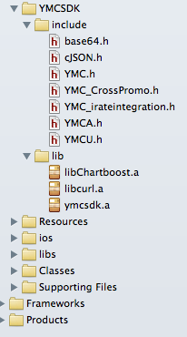

# YMC C++ SDK 

## Overview 概况

**YMC SDK** offers mobile game developers the chance to sccess YMC User system and Analytics information.

游戏开发者可以使用YMC SDK实现用户帐号管理并统计游戏经营数据。

For **Cocos2D-x** and other **C++** games, we deliver header files / libraries for both iOS & Android platforms, and they can be used immediately to utilize what's offered by the YMC User and Analytics systems. 

YMC为使用C++或Cocos2D-x引擎开发的游戏提供了Android和iOS版本的SDK头文件和库。

## Get Started 起步
The C++ SDK is available from YMC Developer's site [https://developer.ymcgames.com](), and you should choose the binaries according to your target platforms (Android / iOS).

开发者可以从YMC的开发者网站下载Android或iOS平台的SDK。

## What's inside the SDK 内容
The SDK header files and libraries is organized as following folders:

SDK的头文件和库文件目录结构如下：

	include/
		YMCU.h
		YMCA.h
		...
	lib/	
		ymcsdk.a
		...

and they should be put into your game project and accessed correctly.

请将其正确放置于游戏代码工程中。

## YMCU 用户帐号管理

To use YMC User system, please use the APIs declared in the header file YMCU.h:

请包含下述头文件：

	#include "YMCU.h"
	
### Initialization 初始化

Please call the following API to initialize things first:

在使用其它API之前，请先调用

	YMCResult YMCUserInit(YMCUserOptions* ymcUserOptions);
	
where the *YMCUserOptions* is declared as:

*YMCUserOptions* 类型定义：

    typedef struct  {
        char game_id[MAX_GAME_ID_LENGTH];
        int use_test_server;  // 0 <- use live server, 1 <- use test server
    }YMCUserOptions;
	
Example:

例子：

    YMCUserOptions userOptions;
    strcpy(userOptions.game_id, YOUR_GAMEID);
    userOptions.use_test_server = 1;
    YMCUserInit( &userOptions );
    	
### Register a YMC account:

注册YMC用户帐号：

This API is for user account registration:
  
	YMCResult YMCUserRegister(eMail, password, username,NULL,NULL, NULL,
                          (YMCUOnSuccess)OnSuccess,
                          (YMCUOnError)OnError);
                          
Most YMCU APIs are implemented as asynchronous calls, and the following function points should be supplied as callback paramaters:

大部分YMCU API是以异步方式工作的，调用时须传递下面两个回调函数指针：

    void OnError(char* error_response, void* pdata);
    void OnSuccess(YMCUserSession *puserSession, void *pdata)

Example:

例子：

    void OnError(char* error_response, void* pdata)
    {
    	CCLOG("Error! ");
    	CCLOG("%s", error_response);
        //...
    }

    void OnSuccess(YMCUserSession *puserSession, void *pdata)
    {
    	CCLOG("Success! ");
    	CCLOG("access_token: %s", puserSession->access_token);
    	CCLOG("user_id: %d",puserSession->user_id);
    	CCLOG("expires: %d",puserSession->expires);
    
    	//...
    }

    YMCResult result;
    result = YMCUserRegister(eMail, password, username,NULL,NULL, NULL,
                          (YMCUOnSuccess)OnSuccess,
                          (YMCUOnError)OnError);
                         
### Login: 登录

Same as Registration, only should be used for existing account:

适用于已注册的用户帐号： 

	YMCResult result;
	result = YMCUserLogin(eMail, password, username, NULL,
                          (YMCUOnSuccess)OnSuccess,
                          (YMCUOnError)OnError);
        CCLOG("Login Result: %d",result);
    

### Logoff: 登出

	YMCResult result;
    result = YMCUserLogout(&currentSession, NULL, NULL, NULL);
    CCLOG("Logoff Result: %d",result);
    
### Retrieve Profile of current user: 获取当前用户详情
YMC User Account is described by the following Struct:
YMC用户帐号定义如下：

    typedef struct {
        char user_name[MAX_USER_NAME_LENGTH];
        char email[MAX_EMAIL_LENGTH];
        char first_name[MAX_NAME_LENGTH];
        char last_name[MAX_NAME_LENGTH];
        char gender[MAX_NAME_LENGTH];
        char gamesJSON[MAX_JSON_STRING];
    } YMCUser;
    
To retrieve the user details in current Session:    
获取当前Session的用户详情：

	YMCResult YMCUserGetInfo(YMCUserSession* userSession,
                            void* pdata,
                            YMCUOnSuccessUserInfo OnSuccess,
                            YMCUOnError OnError);
where the "OnSuccess" callback fuction pointer is declared as:
"OnSuccess"回调函数类型定义如下：

	typedef void (*YMCUOnSuccessUserInfo)(YMCUser* puser, void* pdata);
                           
### Ask for resending password to my Email: 忘记密码

This API is used to help the users when he forgot his password:
使用此API重置密码：

	YMCResult YMCUserPasswordForgot(const char* email,
                                    void* pdata,
                                    YMCUOnSuccessForgot OnSuccessForgot,
                                    YMCUOnError OnError);
     

## YMCA  YMC经分系统

To use YMC Analytics service, please use the APIs declared in the header file YMCA.h:
头文件：

	#include "YMCA.h"

### Initialization 初始化
Please call yaInit to initialize with your Game's YMC ID:
请使用YMC ID初始化:

	yaInit(YOUR_GAMEID);

### Track purchasement 记录游戏内购
yaCharge should be called to track any purchasement made by the game player.

    void yaCharge(const char *currency, double value);
    
Example:
例子：

     yaCharge("USD",6.99);
     yaCharge("RMB",35);

### yaEvent 经分事件
Events describe things that happen in your game, usually as the result of user interaction; for example, when a player conquered a level, or purchased some equipment, you can send an event to record the incident.
yaEvent描述了当前游戏中需要被记录下来以便随后系统分析的各种事件。
	
### Track custom events 记录自定义事件
Sometimes you might want to track other specific things happened in your game, such as when the player passed one level, and YMCA allows developers construct customized yaEvent for such purpose: 
如果需要记录特定的游戏事件，可以构造和定制yaEvent加以描述：

    yaEvent *yaEventCreate(const char *name);

    //添加数字属性：
    void yaAddNumber(yaEvent *event,const char*key,double value);

    //添加字符串属性：
    void yaAddString(yaEvent *event,const char *key, const char *value); 

and track the custom event with:
然后记录此事件：
    
    void yaTrack(yaEvent *event);		

Example:

	yaEvent *evt = yaEventCreate("Level_Up");
	yaAddString(evt, "Beat", "Playerx");
	yaAddNumber(evt, "Level", 10);
	yaTrack(evt);

